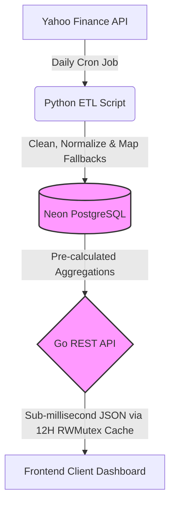

# Prisma Global Growth - Backend Infrastructure

An end-to-end financial data pipeline and high-performance REST API designed to power the Spring Street Prisma Factsheet experience. 

This system features a decoupled architecture, separating heavy data ingestion from client-facing data delivery, ensuring high availability, automated data freshness, sub-millisecond API response times, and an interactive analytics interface.

🔗 **Live Production BACKEND Deployment URL:** [https://prisma-factsheet-api.onrender.com/](https://prisma-factsheet-api.onrender.com/api/factsheet)
🔗 **Live Basic Data vizualization URL:** [https://prisma-factsheet-api.onrender.com/](https://prisma-factsheet-api.onrender.com/)

## 🏗 System Architecture



## 🚀 Key Engineering Decisions

- **Hybrid Micro-Services:** Leverages Python for robust market data scraping (`yfinance`) and Go for a strictly typed, high-concurrency client API.
- **Advanced ETF Look-Through Mapping:** Rather than treating index ETFs as static blocks, the database unpackages tracking assets using a custom structural mapping layer. The Go backend utilizes a relational SQL `LEFT JOIN` and a mathematical `COALESCE` query to dynamically strip wrapper allocations and compute true underlying look-through exposure.
- **Optimized In-Memory Caching:** Implements Go's native, thread-safe `sync.RWMutex` to cache expensive financial queries directly in the application RAM. This drops production API latency from ~150ms down to `<1ms`.
- **Pragmatic 12-Hour TTL:** Since the Python data pipeline refreshes the master asset ledger once every 24 hours, the Go cache uses a 12-hour Time-To-Live (TTL) to guarantee clean synchronization cycles without manual database strain.
- **Automated Data Freshness:** The ingestion pipeline runs completely autonomously via a GitHub Actions CRON workflow at midnight UTC daily, pulling live asset metrics, computing market cap tiers, and saving exposures.
- **High-Density Presentation Layout:** Contains a dedicated web interface featuring unified, non-redundant client tracking. It moves overlapping text listings into dynamic Chart.js elements and presents core asset metrics side-by-side with fully expanded look-through breakdowns.

## 🛠 Tech Stack

- **API:** Go (Golang), `chi` router
- **ETL Pipeline:** Python, `yfinance`, `psycopg2`
- **Database:** PostgreSQL (Neon Serverless)
- **Frontend Visualization:** Static HTML5/Vanilla JS, Tailwind CSS CDN, Chart.js CDN
- **Infrastructure:** Render (API & Dashboard Hosting), GitHub Actions (Cron Automation)

## 🚦 Local Setup Instructions

### 1. Database Setup
Create a PostgreSQL instance (Neon.tech or local) and execute the schema initialization rules found in `internal/database/init.sql`.

### 2. Run the ETL Pipeline (Python)
Populate the master data nodes with live metrics:

```bash
export DATABASE_URL="your_postgres_connection_string"
pip install -r scripts/requirements.txt
python scripts/fetch_data.py
```

### 3. Start the API Server (Go)
Download required router modules, build the application binary, and spin up the runtime server:

```bash
export DATABASE_URL="your_postgres_connection_string"
export PORT="8080"
go mod tidy
go build -o factsheet cmd/api/main.go
./factsheet
```

## 📖 API Reference & Live Links

### `GET /`
Serves the dark-themed visual web dashboard. It binds directly onto the underlying dataset, animates macroeconomic distribution profiles, tracks cross-origin latency speeds, and unrolls nested tables simultaneously.

### `GET /api/factsheet`
Returns the raw, structured, and aggregated Prisma Global Growth JSON object containing asset valuations, trailing 12-month P/E ratios, and computed look-through vectors.

#### Expected Output Schema:
```json
{
  "portfolio_id": 1,
  "name": "Global Growth Prisma",
  "description": "End-to-end global investing diversified portfolio for resident Indians.",
  "holdings": [
    {
      "ticker": "VOO",
      "name": "Vanguard S&P 500 ETF",
      "weight": 0.2500,
      "current_price": 695.3400,
      "pe_ratio": 28.5000
    }
  ],
  "ultimate_underlying_holdings": [
    {
      "ticker": "AAPL",
      "name": "Apple Inc.",
      "true_effective_weight": 0.0863
    }
  ],
  "sector_exposure": [
    { "name": "Technology", "percentage": 0.2400 }
  ],
  "regional_exposure": [
    { "name": "United States", "percentage": 0.4200 }
  ]
}
```
