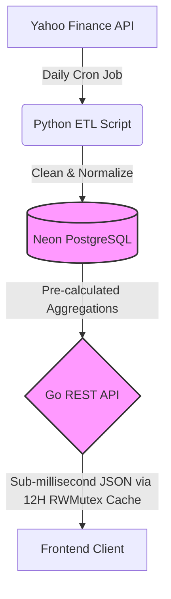

# Prisma Global Growth - Backend Infrastructure

An end-to-end financial data pipeline and high-performance REST API designed to power the Spring Street Prisma Factsheet experience. 

This system features a decoupled architecture, separating heavy data ingestion from client-facing data delivery, ensuring high availability, automated data freshness, and sub-millisecond API response times.

## 🏗 System Architecture



## 🚀 Key Engineering Decisions

- **Hybrid Micro-Services:** Leverages Python for robust market data scraping (`yfinance`) and Go for a strictly typed, high-concurrency client API.
- **Advanced ETF Look-Through:** Rather than treating ETFs as static line items, the database utilizes relational SQL `COALESCE` joins to unpack funds (e.g., VOO) and calculate the *true* underlying asset exposure mathematically.
- **Optimized In-Memory Caching:** Implements Go's native `sync.RWMutex` to cache expensive financial aggregations in memory. This drops API latency from ~150ms down to `< 1ms`.
- **Pragmatic 12-Hour TTL:** Since the Python data ingestion pipeline updates the asset database once every 24 hours, the cache uses a 12-hour Time-To-Live (TTL). This minimizes Neon connection overhead while ensuring data changes sync predictably.
- **Automated Data Freshness:** The ETL pipeline runs completely autonomously via a GitHub Actions CRON job at midnight UTC, seamlessly pushing daily updates to the master PostgreSQL database.

## 🛠 Tech Stack

- **API:** Go (Golang), `chi` router
- **ETL Pipeline:** Python, `yfinance`, `psycopg2`
- **Database:** PostgreSQL (Neon Serverless)
- **Infrastructure:** Render (API Hosting), GitHub Actions (Cron Automation)

## 🚦 Local Setup Instructions

### 1. Database Setup
Create a free PostgreSQL database on Neon.tech or any server or locally and execute the schema found in `internal/database/init.sql`.

### 2. Run the ETL Pipeline (Python)
Populate the database with live market data:

```bash
export DATABASE_URL="your_neon_postgres_string"
pip install -r scripts/requirements.txt
python scripts/fetch_data.py
```

### 3. Start the API Server (Go)
Launch the Go server to serve the factsheet data:

```bash
export DATABASE_URL="your_neon_postgres_string"
export PORT="8080"
go build -o factsheet cmd/api/main.go
./factsheet
```

## 📖 API Reference

### `GET /api/factsheet`
Returns the fully aggregated Prisma Global Growth portfolio, including high-level holdings, true underlying exposures, and calculated sector/regional breakdowns.
